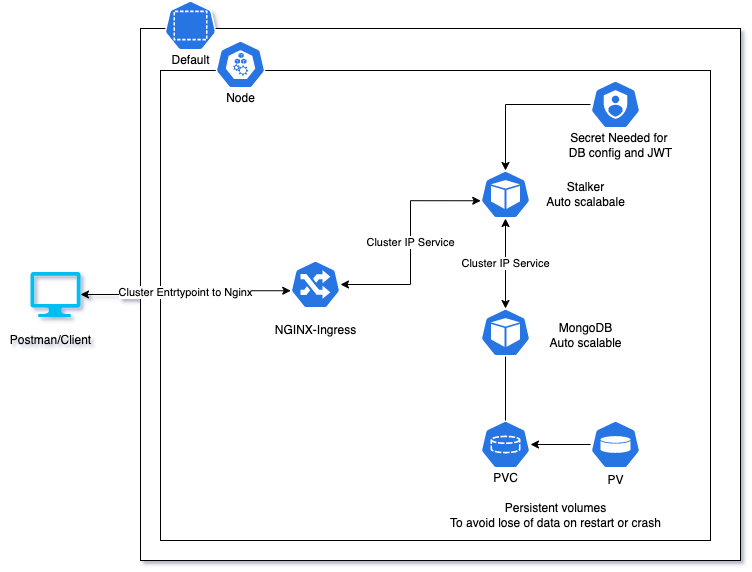
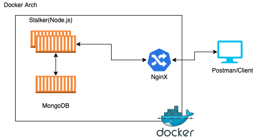

# stalker
You can leave the product stalking to him and enjoy your tea

## Tech Stack
1. Node.js - BackEnd, Most operations of the project were I/O intensive.
2. MongoDB - Database
3. Pino - Logging framework, It has quite low overhead in compare to other loggers
4. CI/CD - Github actions
5. K8s - All the needed api files are located in K8s folder
6. Nginx - To keep our server safe from DoS attacks. It also helps us in easily scaling, faster response using cache and traffic routing.
7. Jest - Unit tests (Only auth unit tests has been added for now)
## How to run?

This application is compatible with docker as well as kubernetes.
### Docker

1. Run the below command
    ```bash
    docker-compose up --build
    ```
2. You can now access the website at `http://localhost/`

>**You should have docker installed on your system
### Kubernetes

1. Run the below command
    
    ```bash
    cd k8s
    kubectl apply -f .
    ```

2. This will start the application in your cluster and you can access it using the ingress ip assigned to you by kubernetes.

>**You should have kubenetes enabled and nginx-ingress addon installed on your system.  
>One of the easiest way to manage kubenete locally is [Minikube](https://minikube.sigs.k8s.io/docs/start/)


## How to test?

Please use the `Stalker.postman_collection.json` located at `root` folder to import all the APIs it has along with examples to your `postman`.

## Architecture

### K8s



### Docker

